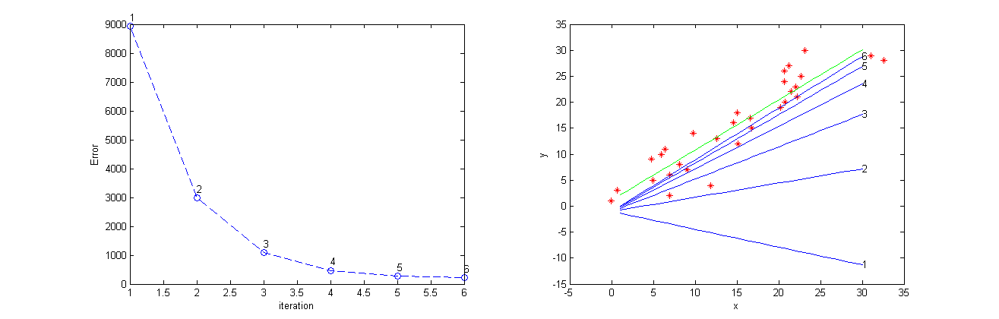
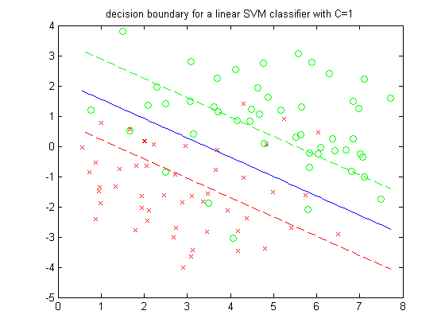
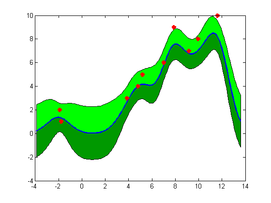
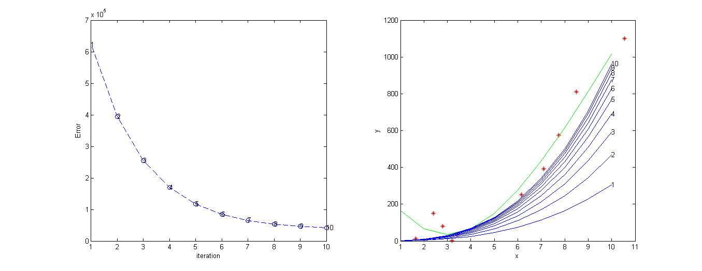
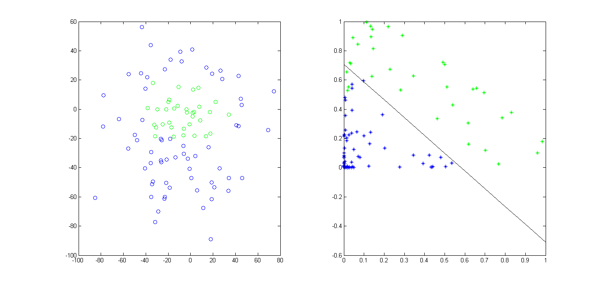
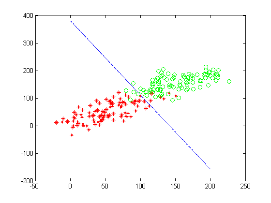
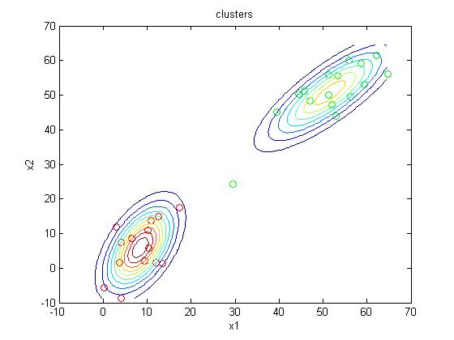
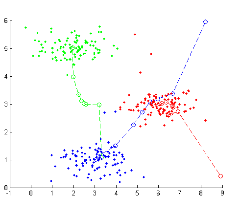
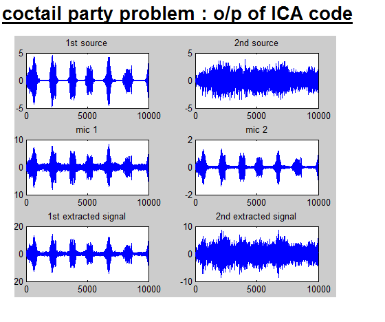
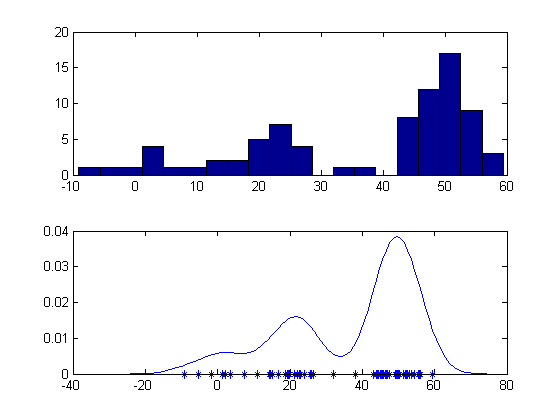

Linear Regression
---------------------

Linear SVM
---------------------

Gaussian Process
---------------------

Linear Regression (Multiple Features)
---------------------

Gaussian kernel
---------------------

Linear classifier
---------------------

Learning Gaussian Mixture Model Using Expectation Maximaization algorithm
---------------------

K-means
---------------------

ICA
---------------------

Density estimation
---------------------

